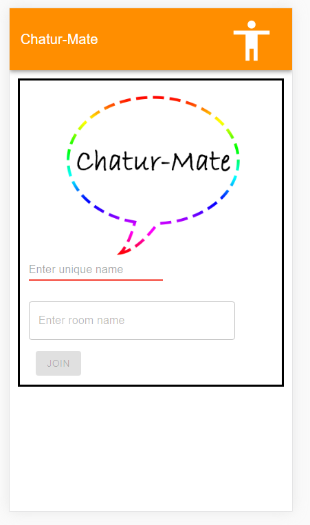
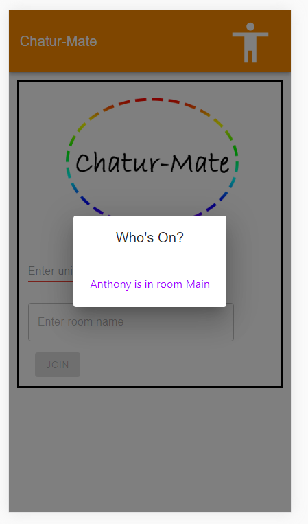
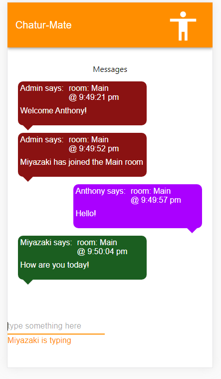

# ChatApp
Javascript Mobile (PWA) Chatt app. Uses node for the server, and react for the frontend.

note: *Styled for mobile footprints, does not look amazing on desktops*

url: https://anthonymerante-chatapp.herokuapp.com/

  
  
  
